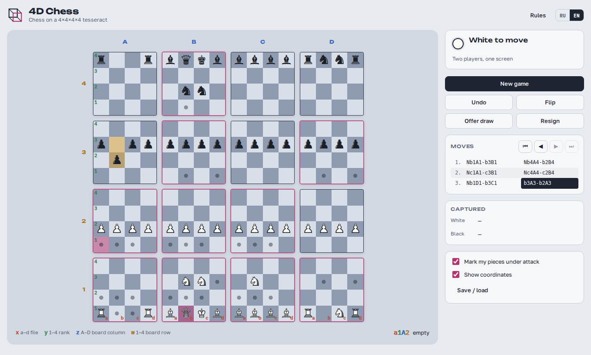

# 4D Chess

Chess on a 4×4×4×4 tesseract (256 squares), playable in the browser: against a friend on one
screen or against the computer at three difficulty levels. The interface is available in Russian
and English.



## Playing

- Click one of your pieces: dots mark where it can go and every board with a legal move lights up.
  Hover a destination to see the line the move takes across the boards.
- An orange corner marks your piece that is attacked and unprotected (or attacked by a cheaper piece).
- `←` / `→` step through the game; click any move in the list to see that position.
- **Save / load** copies the game as text or loads a game from text.
- The current game and settings are kept in the browser (localStorage).

## Rules

### Board and notation

Every square has four coordinates, shown as a 4×4 grid of small boards:

| Axis | Meaning                      | Values |
| ---- | ---------------------------- | ------ |
| x    | file inside a small board    | a–d    |
| y    | rank inside a small board    | 1–4    |
| z    | column of boards             | A–D    |
| w    | row of boards                | 1–4    |

A square is written with all four: `b2C3` is square b2 on board C3. Moves use long notation:
`Nb1A1-b3A2`, `a3A3xb3A2`, `a4A3xb4A4=Q`, with `+` for check and `#` for mate.

Square colour follows the parity of x + y + z + w, so bishops keep to one colour as in ordinary chess.

### Starting position

Each side has 32 men: king, queen, 4 rooks, 4 knights, 6 bishops and 16 pawns.

- White pieces: rank 1 of boards A1–D1. White pawns: rank 2 of boards A2–D2.
- Black pieces: rank 4 of boards A4–D4. Black pawns: rank 3 of boards A3–D3.

Files a–d on the back boards: **A** R N N R · **B** B Q K B · **C** B B B B · **D** R N N R.
Neither side can capture anything on the first move.

### Pieces

A direction changes each coordinate by −1, 0 or +1 (80 directions in total).

| Piece  | Moves                                                         | Directions |
| ------ | ------------------------------------------------------------- | ---------- |
| Rook   | exactly one coordinate, any distance                          | 8          |
| Bishop | exactly two coordinates by the same distance                  | 24         |
| Queen  | any set of coordinates by the same distance                   | 80         |
| King   | one step in any direction                                     | 80         |
| Knight | two along one axis and one along another, jumping             | 48 jumps   |

### Pawns

- Two forward directions: rank (y) and board row (w). White heads for rank 4 / row 4, Black for rank 1 / row 1.
- Move: one square forward along y or w onto an empty square. No double step, no en passant.
- Capture: one square forward (y or w) plus one square sideways (x or z).
- Promotion: a white pawn reaching rank 4 on a board in row 4 (Black: rank 1 on a board in row 1)
  becomes a queen, rook, bishop or knight.

### End of the game

Checkmate wins. Stalemate, threefold repetition, 50 moves per side without a capture or pawn move,
and insufficient material (bare kings, a single minor piece, or only same-coloured bishops) are
draws. There is no castling.

## Computer opponent

The engine (`src/ai`) runs in a Web Worker: iterative-deepening principal-variation search with a
transposition table, null-move pruning, late-move reductions and pruning, killer/history move
ordering and a capture-only quiescence search. The evaluation counts material (the bishop is valued
above the rook here: it has 24 line directions against the rook's 8), centralisation, pawn progress
and king shelter.

| Level  | Search                                   |
| ------ | ---------------------------------------- |
| Easy   | 1 ply, picks among near-best moves       |
| Medium | up to 3 plies, ~1.5 s                    |
| Hard   | as deep as fits in ~4 s (usually 4 plies) |

If the browser blocks workers, the search falls back to the main thread.

## Development

Requires Node.js 22+.

```bash
npm install
npm run dev          # local dev server
npm test             # engine and search unit tests (Vitest)
npm run typecheck
npm run build        # static site in dist/
npm run build:single # one self-contained HTML file in dist-single/ (works from disk)
```

### Deploying

`.github/workflows/pages.yml` runs the tests and builds on every push and pull request, and deploys
`main` to GitHub Pages. Enable it once in **Settings → Pages → Source: GitHub Actions**.
The build uses relative paths, so `dist/` can also be served from any static host or sub-folder.

### Layout

```
src/
  engine/     rules: geometry tables, position (make/unmake, hashing), move generation,
              game state (outcomes, records), notation
  ai/         evaluation, search, worker and its client
  ui/         board view, app controller, translations, storage helpers
  styles/     stylesheet
  assets/     chess glyph font
tests/        Vitest suites for the rules and the search
```

## Licence

Apache 2.0 (see `LICENSE`). The chess piece glyphs are a subset of
[Noto Sans Symbols 2](https://github.com/notofonts/symbols), © The Noto Project Authors, under the
SIL Open Font License 1.1 (`src/assets/fonts/OFL.txt`).
